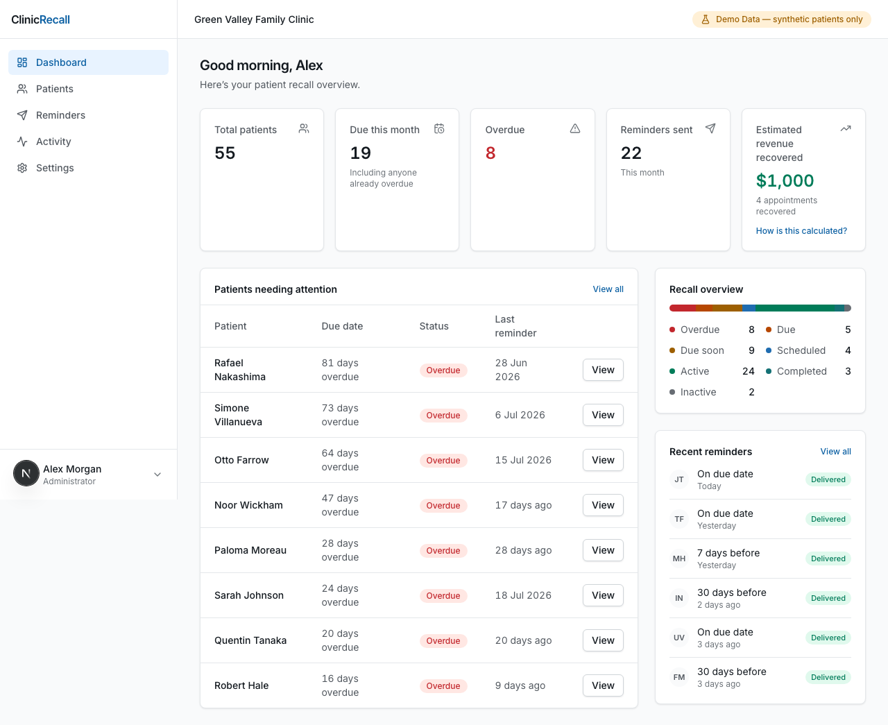
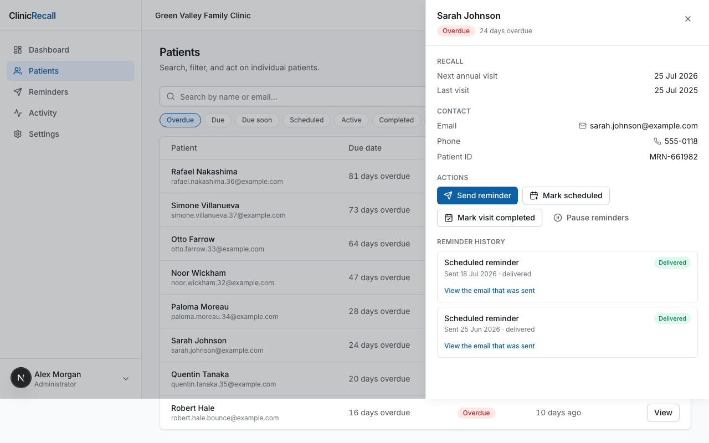
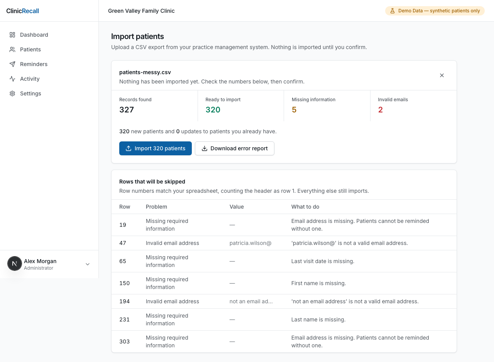
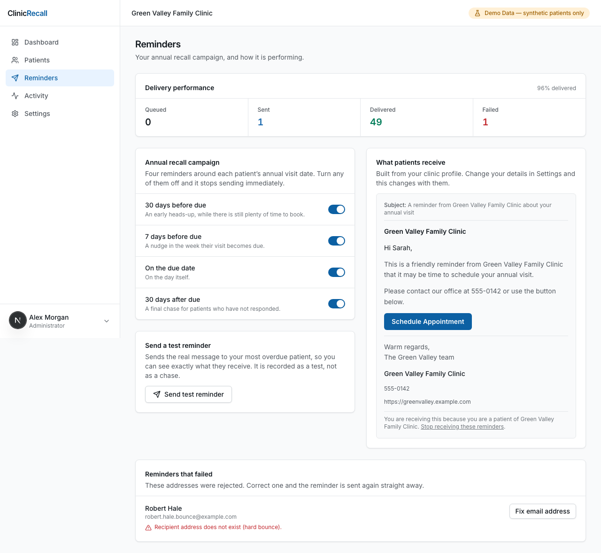

# ClinicRecall

**Reduce missed annual visits.** ClinicRecall identifies which of a practice's patients are due
for their annual appointment and sends them professional email reminders — then tracks what
happened, so the clinic can see the appointments it recovered.

**[▶ Try the live demo](#)** — sign-in credentials are pre-filled; just click Sign in.

> **Demo data only.** Every patient record in this project is synthetic. Nothing here is, or
> claims to be, HIPAA compliant. See [`docs/SECURITY.md`](docs/SECURITY.md) for what a real
> healthcare deployment would additionally require.

---

## Contents

- [What it does](#what-it-does)
- [Screenshots](#screenshots)
- [Stack](#stack)
- [Repository structure](#repository-structure)
- [Prerequisites](#prerequisites)
- [Setup](#setup)
- [Running the app](#running-the-app)
- [Common commands](#common-commands)
- [Deploying it](#deploying-it)
- [Documentation](#documentation)
- [Build status](#build-status)

---

## What it does

The whole product is one loop:

```
upload a CSV of patients
        ↓
the system works out who is due for their annual visit
        ↓
reminder emails are scheduled and sent
        ↓
staff see the activity and mark appointments as scheduled
        ↓
the visit is marked completed
        ↓
the next annual due date is recalculated automatically
```

Anything not on the path from "upload CSV" to "revenue recovered" is deliberately out of scope.
There are no charts, diagnoses, prescriptions, billing, or scheduling features here, and there
will not be.

## Screenshots

Every image below is regenerated by the Playwright suite on each `make verify`, one per step of the
demo walkthrough. They cannot go stale without a test failing first.

| The dashboard | A patient |
|---|---|
|  |  |
| Fifty-five patients, nineteen due this month, eight overdue. | Every reminder sent, and the actual email each one contained. |

| Importing a real export | Reminders |
|---|---|
|  |  |
| 327 found, 320 ready, and every skipped row with its reason. | Four toggles, delivery performance, and the failures worth chasing. |

The full set is in [`docs/screenshots/`](docs/screenshots/), numbered in demo order.

## Stack

| Layer | Technology |
|-------|-----------|
| Frontend | Next.js (App Router), React 19, TypeScript (strict), Tailwind v4, shadcn/ui, lucide-react |
| Backend | Python 3.12, FastAPI, SQLAlchemy 2.x (typed), Pydantic v2, Alembic |
| Database | PostgreSQL 17 (inside the local Supabase stack) |
| Auth | Supabase Auth (GoTrue), run locally in Docker — real JWTs, real JWKS verification |
| Email | Pluggable provider; a fully functional mock is the default (no paid service, no network) |
| Tooling | pnpm 9 workspaces, uv, Makefile, ruff, mypy, ESLint, pytest, Playwright |

Everything runs locally. There is no cloud dependency and no runtime network access, which is a
hard requirement: this gets demonstrated in clinics, on guest wifi that is frequently
captive-portalled or blocked.

## Repository structure

```
.
├── Makefile              ← start here; every workflow has a target
├── apps/
│   ├── api/              ← FastAPI backend
│   │   ├── app/
│   │   │   ├── routers/       HTTP layer: parse, authorise, delegate
│   │   │   ├── services/      domain rules (no HTTP, no SQL)
│   │   │   ├── repositories/  database queries (org-scoped)
│   │   │   ├── models/        SQLAlchemy tables
│   │   │   ├── schemas/       Pydantic request/response types
│   │   │   ├── email/         rendering + delivery providers
│   │   │   ├── jobs/          the reminder processor
│   │   │   └── core/          config, database, security
│   │   └── tests/
│   └── web/              ← Next.js frontend
│       └── src/
│           ├── app/           routes (App Router)
│           ├── components/    UI
│           └── lib/           helpers
├── docs/
│   ├── SPEC.md           ← the build contract
│   ├── ARCHITECTURE.md   ← module boundaries and the status state machine
│   ├── SECURITY.md       ← every security control and its rationale
│   ├── DEMO_SCRIPT.md    ← the literal talk track for a clinic demo
│   └── samples/          ← example CSVs for the import flow
├── scripts/              ← setup, verification, and demo utilities
└── supabase/             ← local Supabase stack configuration
```

## Prerequisites

You need four things installed. The Supabase CLI is **not** in this list — `make setup` installs
a pinned copy for you.

| Tool | Version | Check it | If you need it |
|------|---------|----------|----------------|
| Docker | any recent | `docker info` | [Docker Desktop](https://www.docker.com/products/docker-desktop/) — **must be running** |
| Node.js | 20 LTS | `node -v` | [nodejs.org](https://nodejs.org/) or `nvm install 20` |
| pnpm | 9.x | `pnpm -v` | `npm install -g pnpm@9` |
| uv | latest | `uv --version` | `curl -LsSf https://astral.sh/uv/install.sh \| sh` |

You do **not** need Python 3.12 installed — `uv` downloads and manages the right interpreter
itself, regardless of what Python is already on your machine.

> **Start Docker Desktop before you run anything.** The database and the auth server run in
> containers. If Docker is not running you will get a clear error telling you so, but it is
> quicker to start it now.

## Setup

From a clean clone, two commands:

```bash
make setup
```

This installs the Supabase CLI, creates your `.env`, installs Python and Node dependencies,
starts the local Supabase containers, and applies the database migrations. The first run
downloads several container images and can take a few minutes; later runs take seconds.

Then load the demo data:

```bash
make seed
```

## Running the app

```bash
make dev
```

That starts everything and prints where to find it:

| | URL |
|---|---|
| Web app | http://localhost:3000 |
| API docs | http://127.0.0.1:8000/docs |
| Supabase Studio (browse the database) | http://127.0.0.1:54323 |

Press `Ctrl-C` to stop. The Supabase containers keep running in the background; stop those too
with `make supabase-stop`.

### Demo credentials

`make seed` creates these two accounts through the Supabase admin API. They exist only in your
local Supabase instance and hold nothing but synthetic records.

| Role | Email | Password |
|------|-------|----------|
| Admin | `alex.morgan@greenvalley.example.com` | `ClinicRecallDemo2026!` |
| Staff | `jordan.reyes@greenvalley.example.com` | `ClinicRecallDemo2026!` |

Sign in as **Alex Morgan** for the full demo — the admin-only utilities in Settings (Run reminder
job, Reset demo data) are hidden from the staff account, which is what the second login is for.

Re-running `make seed` resets both passwords to the values above, so a demo account someone
fiddled with goes back to what this table says.

### What the demo data looks like

One practice — **Green Valley Family Clinic** — with 55 synthetic patients spread across every
recall status, and about 90 days of backdated reminder and activity history so no screen is empty
at first login.

Six patients are guaranteed to be in specific states, because the demo script names them:

| Patient | State | Why they exist |
|---------|-------|----------------|
| Sarah Johnson | Overdue, ~24 days | The demo opens here. Two reminders already delivered, the third deliberately unsent so there is something to send live. |
| Michael Brennan | Due soon, ~11 days | The campaign working ahead of a due date. |
| Jennifer Tran | Due today | Reminded automatically this morning. |
| David Okafor | Scheduled | Reminded, then booked — the outcome the product exists to produce. |
| Maria Castillo | Completed | Seen 6 days ago; the cycle rolled forward a year. |
| Robert Hale | Overdue, failed reminder | A hard bounce, so the failure-recovery flow has something real in it. |

All identities are fictional, every email is on `@example.com`, and every phone number is in the
555 range. Nothing here can reach a real person.

## Common commands

Run `make` on its own to see the full list. The ones you will actually use:

| Command | What it does |
|---------|--------------|
| `make setup` | One-time install and database preparation |
| `make dev` | Start the whole stack |
| `make seed` | Load the demo data (safe to run repeatedly, but see the note below) |
| `make samples` | Regenerate `docs/samples/*.csv` with dates relative to today |
| `make demo-reset` | Wipe changes and restore pristine demo data, in under 30 seconds |
| `make test` | Run the Python test suite |
| `make e2e` | Run the Playwright walkthrough and the accessibility pass |
| `make lint` | Run every linter and formatter in check mode |
| `make fmt` | Auto-fix formatting |
| `make typecheck` | Run mypy and the TypeScript compiler |
| `make verify` | Run every quality gate — this is the definition of done |

**`make seed` will not refresh the dates.** It is idempotent — every seeded row has a derived,
stable ID, so re-running it leaves existing rows exactly as they are. That is what makes it safe
to run repeatedly, but it also means a database seeded three days ago still holds three-day-old
"sent this morning" timestamps, and the demo drifts.

Use `make demo-reset` to put the dates back where they belong. It clears and reseeds, which takes
about the same time and is the only command that regenerates the relative dates. If the Python
tests fail on a seed assertion, this is almost always why.

`make verify` is the one that matters. It exits 0 only when the migrations apply cleanly, the
seed is idempotent, all linters and type checkers pass, every test passes, the Playwright
walkthrough of the demo completes without a console error, and no server-side secret has leaked
into the browser bundle.

## Deploying it

The demo runs entirely on your machine and needs no network, which is the point — see
[Running the app](#running-the-app) above.

To put it on the internet instead, [`docs/DEPLOYMENT.md`](docs/DEPLOYMENT.md) walks through the
free three-service setup: Vercel for the frontend, Supabase Cloud for the database and auth, and
Render for the API, with a scheduled workflow that keeps the free instance warm and restores the
demo data hourly.

```bash
docker build -t clinicrecall-api apps/api
```

## Documentation

| Document | What is in it |
|----------|---------------|
| [`docs/SPEC.md`](docs/SPEC.md) | The build contract — what this product is and is not |
| [`docs/ARCHITECTURE.md`](docs/ARCHITECTURE.md) | Module boundaries, request lifecycle, tenancy, status state machine |
| [`docs/SECURITY.md`](docs/SECURITY.md) | Every security control, why it exists, and what it does not cover |
| [`docs/DEMO_SCRIPT.md`](docs/DEMO_SCRIPT.md) | The talk track for demoing to a clinic owner |
| [`docs/DEPLOYMENT.md`](docs/DEPLOYMENT.md) | Putting the demo online, free, with a keepalive and hourly reset |

## Build status

Built in twelve phases, each landing as a single commit with its own tests passing. All twelve
are complete, and `make verify` runs eleven gates green.

| Phase | | |
|-------|---|---|
| 1 | Foundation and toolchain | ✅ |
| 2 | Schema, migrations, and tenancy | ✅ |
| 3 | RecallService domain core | ✅ |
| 4 | Authentication and security | ✅ |
| 5 | ReminderService | ✅ |
| 6 | CSV import | ✅ |
| 7 | Seed data and demo reset | ✅ |
| 8 | Web foundation and app shell | ✅ |
| 9 | Dashboard and Patients | ✅ |
| 10 | Reminders, Activity, Settings, Import UI | ✅ |
| 11 | End-to-end verification | ✅ |
| 12 | Documentation | ✅ |
