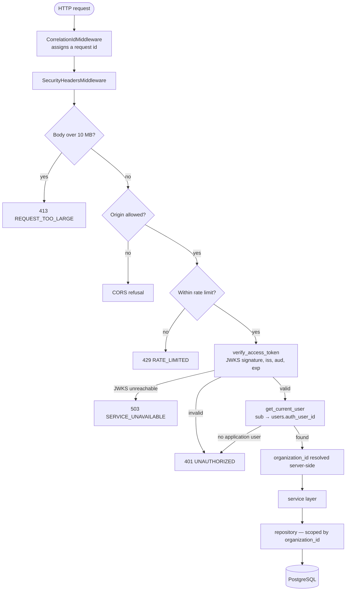
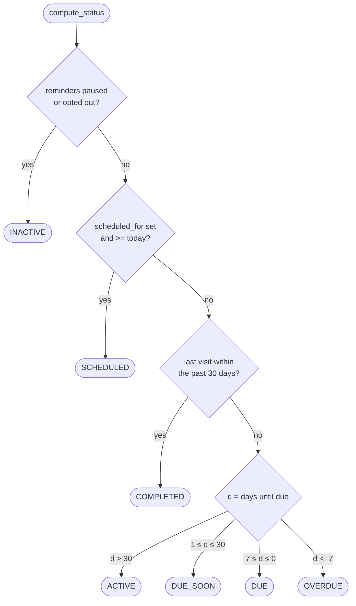
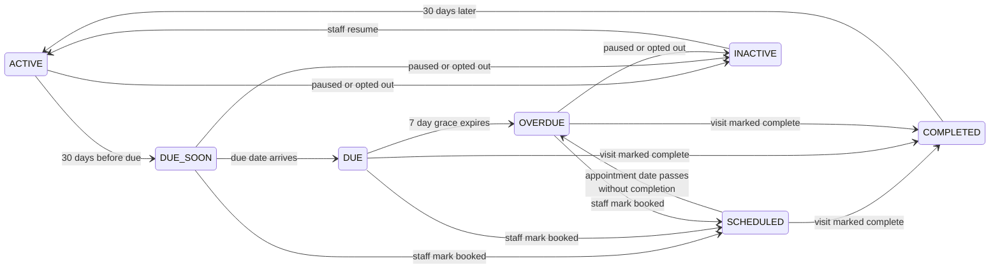
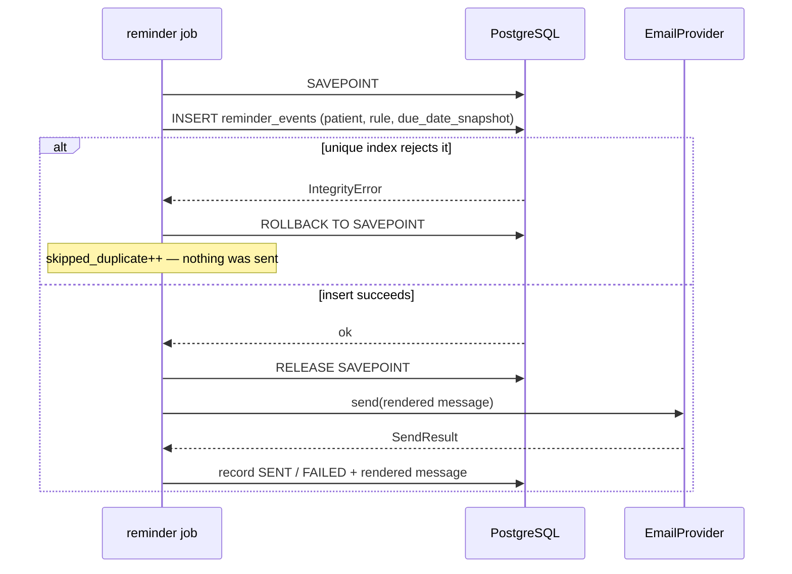

# Architecture

> **Status:** written incrementally as the build proceeds; completed in phase 12. What is here
> now is accurate — it is simply not yet complete.

## Module boundaries

The backend has four layers, and each may only call the one below it.

```
  routers/        HTTP. Parse the request, authorise it, delegate, shape the response.
      ↓           Never issues a query. Never contains a business rule.
  services/       Domain rules. "Is this patient overdue?" "Should this reminder fire?"
      ↓           Knows nothing about HTTP. Knows nothing about SQL.
  repositories/   Database access. Every method takes organization_id as its first argument.
      ↓
  models/         SQLAlchemy table definitions.
```

The rule is enforceable by reading a file: if you find a `select()` in a router, or a `Response`
in a service, the layering has been broken.

Two supporting packages sit alongside rather than inside this stack:

* `core/` — configuration, database session management, security primitives. Cross-cutting.
* `email/` — message rendering and the pluggable delivery provider.
* `jobs/` — the reminder processor, which is a service with a scheduler-shaped entry point.

## Why synchronous SQLAlchemy

FastAPI is frequently written with `async def` endpoints and an async database driver. This
project uses ordinary synchronous SQLAlchemy, and endpoints that need the database are plain
`def` functions, which FastAPI runs in a thread pool.

The reason is [SPEC §13](./SPEC.md#13-working-agreement-for-the-build): prefer boring, readable
code. Async SQLAlchemy adds a class of mistakes — forgotten `await`s, greenlet errors on lazy
loads, session lifetimes that behave differently under concurrency — in exchange for throughput
this application does not need. A single clinic has tens of thousands of patients at the outside,
and the demo has fifty-five.

## Resolved ambiguities

The spec leaves a handful of decisions open. They are recorded here rather than by editing
[`SPEC.md`](./SPEC.md), which is kept verbatim as the contract.

| # | Question the spec leaves open | Resolution |
|---|-------------------------------|------------|
| 1 | How is "visit completed within the last 30 days" detected, given there is no `completed_at` column? | `COMPLETED` is `last_annual_visit_date >= today - 30 days`. A consequence worth knowing: importing a patient seen three weeks ago shows them as COMPLETED, which is honest and matches how staff think about it. |
| 2 | Manual sends must not collide with the reminder idempotency index. | `reminder_events.reminder_rule_id` is nullable and a `source` enum (`RULE` / `MANUAL` / `TEST`) is added. Manual sends carry a null rule ID, so the unique index cannot fire on them. They are rate-limited to one per patient per hour instead. |
| 3 | §4.1's activity type list has no entry for opting out, but §6.5 requires the unsubscribe endpoint to write an activity event. | Added `PATIENT_OPTED_OUT`. |
| 4 | "Appointments recovered" needs the moment an appointment was *marked* scheduled. `scheduled_for` is the appointment date, which is not the same thing. | The `APPOINTMENT_SCHEDULED` activity event's `created_at` is the recovery timestamp. |
| 5 | How often is the cached `patients.status` recomputed? | After every mutation, on API startup, and at the start of the reminder job. This matters for demos left running overnight: statuses self-correct rather than silently going stale. |

## Request lifecycle

What happens between a browser making a request and a row coming back.



Middleware order is significant, and is written in reverse in `app/main.py` because Starlette
applies middleware in reverse registration order. `CorrelationIdMiddleware` is outermost so that
everything inside it — including a size-limit rejection and every error handler — has an
identifier to log and return.

Note the two distinct failure modes at the token step. **Invalid** is 401: we checked and
refused. **JWKS unreachable** is 503: we could not check at all. Collapsing them into 401 would
tell users their session had expired when the real problem was that the auth server was down,
sending them to re-enter a password that was never wrong.

The last two steps are the tenancy guarantee. `organization_id` arrives from the database via a
verified token subject — never from the request — and every repository call below that point
requires it as its first argument.

## Tenancy enforcement

One practice seeing another practice's patients is the worst bug this product could have. Three
independent mechanisms guard against it, and it is worth being precise about which one is load
bearing.

### 1. Repository-level scoping — the primary control

Every repository over a tenant-owned table extends `OrganizationScopedRepository`
([`app/repositories/base.py`](../apps/api/app/repositories/base.py)) and takes `organization_id`
as the **required first argument of every method**.

The usual defence — "remember to add `.where(organization_id == ...)`" — fails the first time
somebody writes a query in a hurry, and it fails silently. Making the scope a required first
parameter converts that mistake into a `TypeError` at the call site, before the process even
reaches the database.

Subclasses never build a `select()` from scratch. They start from `_scoped_select()`, which
already carries the filter, so there is exactly one line in the codebase that defines what
"belongs to this organization" means.

Two supporting details:

* **`add()` overwrites the entity's `organization_id`** with the scope it was called under. A
  service that builds an object from request data and forgets to strip a client-supplied
  organization cannot persist it — the scope argument wins.
* **`get_by_id()` returns `None` across tenants** rather than raising something distinguishable.
  An attacker holding a real ID from another practice gets a 404, indistinguishable from a
  record that does not exist, so the endpoint leaks nothing even in its error behaviour.

### 2. The structural test

`test_every_public_method_takes_organization_id_first` walks each repository class with
`inspect` and asserts the signature rule holds. It covers methods nobody has written a
behavioural test for yet — including one added six months from now.

It found a genuine leak the first time it ran: a `flush()` passthrough on the base class took no
scope. Rather than allowlist it, the method was removed. Services already hold the session, and
deciding *when* to flush is a service concern anyway.

There is exactly one allowlisted exception:
`UserRepository.get_by_auth_user_id`. It is the bootstrap step —

```
JWT.sub  →  users.auth_user_id  →  users.organization_id
```

— and cannot take an organization as input, because the organization is precisely what it exists
to discover.

### 3. Row-level security — the second net

Every tenant table has RLS enabled with a policy keyed on
`current_setting('app.current_organization_id', true)::uuid`.

This is **not** the primary control, and treating it as one would be a mistake. RLS is enabled
but not `FORCE`d, so the table owner — which is the role the API connects as — is exempt. Normal
requests are unaffected by these policies.

What they guard is everything that does not go through our code: a Supabase Studio session, a
future role granted direct table access, or a deployment that runs the app as a non-owner. The
policy's `USING`/`WITH CHECK` pair also means a scoped connection cannot *write* a row belonging
to another organization, not just read one.

Note the failure direction: `current_setting(..., true)` returns `NULL` when unset, and `NULL`
equals nothing, so a connection that has not declared an organization sees **zero** rows.
Forgetting the scope denies access rather than granting it.

`tests/test_rls_policies.py` proves this end to end by creating a throwaway role inside the test
transaction and watching rows appear and disappear as the session variable changes. Catalog
inspection alone would only prove a policy is *installed*, not that its expression is right.

## Status state machine

Patient status is **derived, not authored**. It is not a field anyone sets; it is a pure function
of five values, cached on the row for query performance. `RecallService.compute_status` is the
only thing that decides it, and `apply_derived_fields` is the only thing that writes it.

### The decision

Seven bands, checked strictly top to bottom. The order matters for the first three, because a
patient can satisfy several at once.



The four date-derived bands tile the integers exactly — no gap, no overlap. A test walks 81
consecutive days and asserts there are precisely three transitions across them, which catches
both a band that was split and one that was swallowed.

### How a patient moves

Two of the seven states are **transient by design**: they decay on their own, with nobody
touching the record.



**`SCHEDULED` expires.** If the appointment date passes and nobody marked the visit complete, the
patient drops back to their date-derived band. Without that, a demo left running would show
patients permanently "Scheduled" and the recovery funnel would be a lie (SPEC §5.2).

**`COMPLETED` decays.** Completing a visit advances `last_annual_visit_date`, which pushes the due
date a year out — so the patient would otherwise flip straight to ACTIVE and staff would get no
visible confirmation that their action registered. It shows as COMPLETED for 30 days, then
rejoins the normal population by itself.

**`INACTIVE` outranks everything.** A patient who has withdrawn consent never appears in an
OVERDUE list, because that list is a work queue — surfacing them there invites staff to chase
someone who asked to be left alone, which is the exact mistake the opt-out exists to prevent.

Note the asymmetry on the way out of INACTIVE: staff can undo their own pause, but
`resume_reminders` deliberately does **not** clear `opted_out_at`. Only the patient can reverse
that, through the link in the email they were sent. If staff could un-opt-out someone from the UI,
the unsubscribe link would be decorative.

### Keeping the cache honest

A denormalised column is correct when written and stops being correct the moment a code path
forgets to recompute — silently, and in a way that looks entirely plausible on screen. Three
things guard it:

1. **Every mutation recomputes.** `mark_scheduled`, `mark_completed`, `pause_reminders`,
   `resume_reminders`, and `record_opt_out` all end in `apply_derived_fields`.
2. **Two scheduled sweeps.** `recompute_organization` runs on API startup
   ([`app/core/startup.py`](../apps/api/app/core/startup.py)) and at the top of the reminder job.
   Statuses go stale purely because time passes — a patient who was DUE_SOON yesterday is DUE
   today — so a demo left running overnight corrects itself.
3. **The drift guard.** `find_drifted_patients` re-derives every patient and reports any whose
   stored status disagrees. It is read-only on purpose: a diagnostic that silently repairs what it
   is measuring cannot be used to detect a bug. A test asserts it returns empty, and a second test
   corrupts a row on purpose to prove the detector actually fires.

## Notes on the schema

A few decisions in the data model are not obvious from reading the tables.

**`public_id` on patients.** Twelve characters of Crockford base32 (60 bits), excluding `I`, `L`,
`O`, and `U` so an ID can be read aloud or copied off a screen without ambiguity. It is the only
patient identifier that ever appears in a URL or an API response (SPEC §4.2).

**The reminder idempotency index.** `UNIQUE (patient_id, reminder_rule_id, due_date_snapshot)`
is what makes the reminder job safe to run twice. `due_date_snapshot` is in the key for a subtle
reason: without it, a patient who completes a visit and rolls forward to next year's due date
would be permanently blocked from another 30-day reminder, because one already exists for that
rule. Recording which due date the reminder was computed against makes each annual cycle its own
slot.

**The manual-send carve-out.** `reminder_rule_id` is nullable, and Postgres does not treat two
`NULL`s as equal in a unique index. So a manual "Send Reminder" can never collide with a
rule-driven event — which is what stops the live demo beat from raising a duplicate-key error in
front of a clinic owner.

**Currency is `NUMERIC`, never a float.** In binary floating point `0.1 + 0.2` is not `0.3`, and
an office manager checking a revenue figure by hand will notice a cent.

**Enum types must be dropped explicitly on downgrade.** Alembic's autogenerate creates native
enum types on the way up but only emits `DROP TABLE` on the way down, leaving orphaned types that
make the next `upgrade head` fail. The initial migration drops all eight explicitly, and
`tests/test_migrations.py` fails if a newly added enum is not covered.

## How a reminder is sent exactly once

The order of operations in `ReminderService._process_one` is the whole guarantee, and it is
deliberately counter-intuitive: **the database row is written before the email is sent.**



Three details, each load-bearing:

**Insert first, send second.** Sending first and recording afterwards means a crash between the
two steps sends the patient a second email on the next run. Recording first means the worst case
is a reminder marked created that was never sent — visible, and recoverable.

**The database arbitrates, not the code.** SPEC §6.2 forbids an application-level "have I already
sent this?" query, because two job runs can both execute it, both read "no", and both send. The
check and the send are not atomic and no amount of care in the query makes them so. A unique index
is checked atomically at insert, so exactly one process wins.

**The SAVEPOINT is not optional.** An `IntegrityError` poisons the enclosing transaction in
Postgres. Without `begin_nested()`, the first duplicate would abort every remaining patient in the
run — and the symptom would be "the job stopped working", not "one row already existed".

`due_date_snapshot` is in the unique key so each annual cycle is a separate slot; without it a
patient who was reminded and then seen could never receive that rule again. And
`reminder_rule_id` is nullable so a manual send carries `NULL`, which Postgres never treats as
equal — that carve-out is what stops the live "Send Reminder" demo beat raising a duplicate-key
error on stage.

## How the demo data stays trustworthy

The seed is not a convenience — SPEC constraints D1, D3 and D4 make it part of the product, and
three properties are enforced by tests.

**Deterministic identity.** Every seeded row's UUID is derived from its natural key via `uuid5`
rather than generated randomly. Two things follow. Re-running the seed finds the existing row and
updates it instead of inserting a duplicate, which is how idempotency is achieved without any
upsert logic. And a patient keeps the same `public_id` — and therefore the same URL — across a
`make demo-reset`, so a screenshot, a bookmark, or a Playwright test written last week still
points at Sarah Johnson.

**Nothing is hardcoded to a calendar date.** Every fixture states an offset (`days_until_due`,
`days_ago`) and the runner turns it into a date at seed time. A static test greps the seed source
for `20\d\d-\d\d-\d\d` literals, because the failure it prevents is silent: a demo built on fixed
dates keeps working for about a week, then every status badge starts disagreeing with the date
printed beside it.

**The named fixtures are a contract.** `NAMED_FIXTURES` in `app/seed/fixtures.py` declares each
patient's intended status, and `tests/test_seed.py` asserts the seeded database matches. The demo
script speaks those states aloud, so "approximately right" is not a category that exists here.

Two of them carry constraints that are easy to break by accident:

* **Sarah Johnson's `T_ZERO` is deliberately unsent**, so the live "Send Reminder" beat has
  something to do. At 24 days overdue she sits outside the 3-day catch-up window, so running the
  reminder job during a demo cannot backfill it. A test pins that — widening
  `CATCH_UP_WINDOW_DAYS` fails the suite rather than the demo.
* **David Okafor was reminded *before* he was booked**, because SPEC §8's revenue definition
  requires exactly that sequence. A scheduled patient with no prior reminder would inflate the
  number without justifying it, and the definition is shown on hover so an office manager can
  check.

**Reset is truncate-and-reseed, not rebuild.** Tearing down the Supabase containers takes minutes
and would blow SPEC D3's 30-second budget many times over; a single `TRUNCATE ... CASCADE` plus a
re-seed takes under a second. `auth.*` is left alone so the demo login keeps working, and
`alembic_version` is left alone so the database does not look unmigrated afterwards. A test
asserts the truncate list covers every application table, since one omitted table would quietly
accumulate demo debris across resets.

## Two bugs that only appear inside a transaction

Both were found by a single failing test on the failure-recovery path, and both are worth
recording because neither is visible from reading the code.

### `now()` is the transaction's clock, not the statement's

PostgreSQL's `now()` returns the time the **transaction** began. Every row written inside one
transaction therefore receives a byte-identical `created_at`.

That is harmless for a timestamp meaning "roughly when this happened" and wrong for anything that
orders rows against each other. Two places here do exactly that: the activity feed sorts
newest-first, and the failure-recovery queue asks "has a later reminder to this patient
succeeded?". A corrected resend written in the same request was not *later* than the failure it
replaced, so the queue could never empty.

The append-only tables now default to `clock_timestamp()`, which reads the actual wall clock at
each statement (migration `d24526efb4a6`). The mutable tables keep `now()` — nothing orders rows
within a transaction there, and a transaction-scoped "created" time is arguably more truthful.

### A failed send must not start the manual-send cooldown

The one-hour per-patient cooldown exists to protect a patient's inbox from repeated chasing. A
message that bounced never reached that inbox — so sending again after correcting the address is
not a second email to that person, it is the first one.

Counting the bounce against the cooldown refused the resend for an hour, which left the
failure-recovery queue as a list of problems that could not be fixed from the screen built to fix
them. `_enforce_manual_cooldown` now skips `FAILED` events.

### And what was deliberately *not* changed

The failed event stays `FAILED` forever. Marking it resolved would falsify the patient's timeline
— that send really did fail. Instead the *queue* filters out failures that have since been
superseded by a delivery to the same patient. History stays accurate; the work list stays a work
list.
